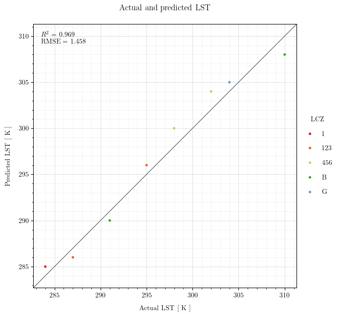

# An Actual-vs-Predicted Fancy Plotter hued with LCZ Classes

The modules found in this project allow one to create an actual-vs-predicted plot using
[seaborn](https://seaborn.pydata.org/) and [LaTeX](https://www.latex-project.org/).
Furthermore, they allow one to print the regression scores on the plot and add a hue to
the markers according to a [QGIS](https://www.qgis.org/) palette for the Local Climate
Zone (LCZ) variable.

## Installation

1. Clone GitHub repository and change directory:

    ```bash
    git clone https://github.com/eliocpereira95/fancy_plotter_actual_vs_predicted.git
    cd fancy_plotter_actual_vs_predicted
    ```

2. Install LaTeX

    In the case of Windows, you would need to install [MiKTeX](https://miktex.org/download).

    In the case of a Debian-based Linux distribution (such as Ubuntu), you do:

    ```bash
    sudo apt-get install -y dvipng texlive-latex-extra texlive-fonts-recommended cm-super
    ```

3. Make sure to initialize `conda` using the command below. After that, open a new
   terminal which would then have the base `conda` virtual environment activated by
   default.

    ```bash
    conda init
    ```

2. Create a dedicated `conda` virtual environment, activate it and install the required
   packages:

    ```bash
    conda create -n fancy_plotter python=3.12
    conda activate fancy_plotter
    pip install -r requirements.txt
    ```

## Usage

Have a look at the Jupyter notebook `examply.ipynb` to undestand how to use the modules.
Be sure to use the created virtual environment as kernel to run it.


